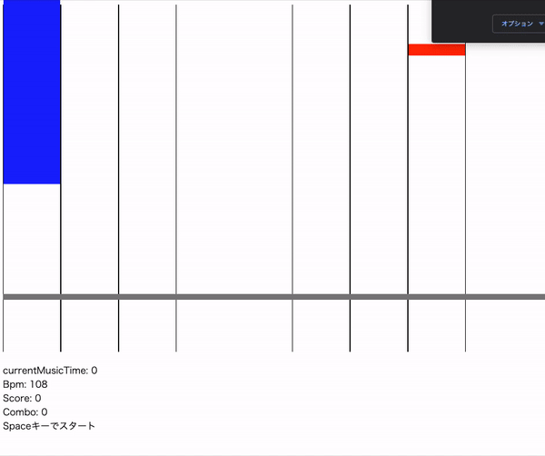

# このアプリについて
Elmでリズムゲームを作ってみました。

# 起動方法
このゲームは[Create Elm App](https://github.com/halfzebra/create-elm-app)を用いて作成しています。

1. $ git clone
2. $ npm install
3. $ npm install -g create-elm-app
4. $ elm-app start

# 音源について
フリー音源(from DOVA SYMDROME)を仕様しています。
